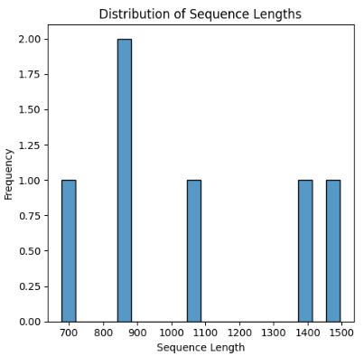
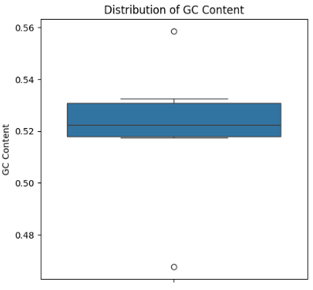
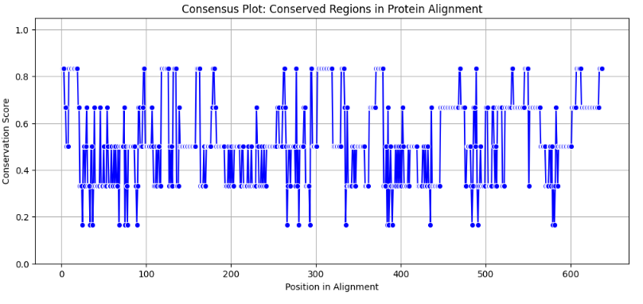
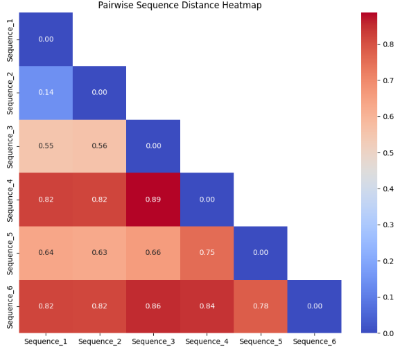
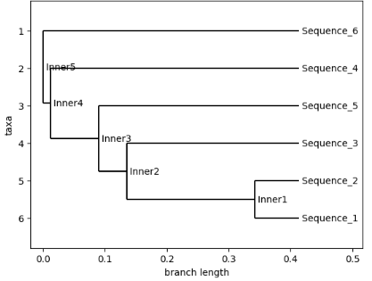

# Results Gallery
## Nucleotide sequence visualizations
From the user-provided FASTA files, sequnce length and GC content are calculated:
{: width="450"}
{: width="450"}

## Translated Protein Sequences
### Concerved Regions 
Concerved regions were determine using the ClustalOmega function and then plotted on a consensus plot:
{: width="600"}

### Pairwise Sequence Distance
{: width="600"}

### Phylogenetic Tree Reconstruction
{: width="600"}
